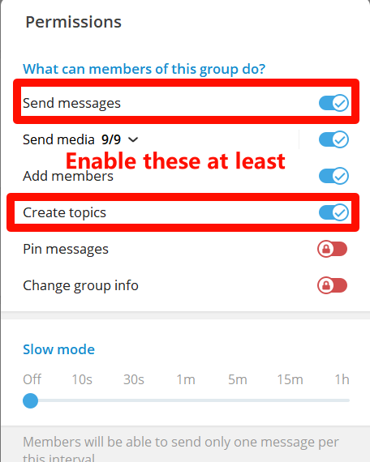

# Telegram interactive bot (Telegram Bidirectional Bot)

## I. Introduction

An open-source bidirectional bot for Telegram. It helps to avoid spam messages and allows restricted clients to contact you smoothly.

[中文文档](https://github.com/MiHaKun/Telegram-interactive-bot/blob/master/README.md) | [Sample Bot](https://t.me/CustomerConnectBot) | [Sample Backend](https://t.me/MiHaCMSGroup)

### Features

- When a client contacts customer service through the bot, all messages will be completely forwarded to the backend management group, creating a separate topic named after the customer's information to differentiate them from other clients.
- Customer service replies in the topic can be directly sent back to the customer.

### Advantages

- By using topics, multiple management members can be added to share the customer service workload.
- Complete communication records with customers can be intuitively retained.
- It's possible to know which customer service representative replied to a particular message, maintaining coherent customer service.

## II. Preparation

The main principle of this bot is to forward the conversation between the customer and the bot to a group (preferably a private group) and summarize each customer's messages into a topic. Therefore, before starting, you need to:

1. Contact @BotFather to apply for a bot.

2. Obtain the bot's token.

3. Get API_ID/API_HASH.

4. Create a group (set as public as needed).

5. Enable "Topics" in the group.

6. Add your bot to the group and promote it to an administrator.

7. Remember to include "Message Management" and "Topic Management" in the administrative permissions.

8. Use the bot @GetTheirIDBot to obtain the built-in ID of the group and the user ID of the administrator.

   !

## III. Deployment

### 1. Modify env

Open `.env_example`, fill in your bot's Token, account's API_ID/HASH, the management group ID, and the administrator's ID. Save `.env_example` as `.env`.

### 2. Build Python venv

```bash
python3 -m venv venv
. venv/bin/activate
pip install -r requirements.txt
```

### 3. Execute startup

```bash
python -m interactive-bot
```

**PS:** For formal operation, it is still necessary to use process management tools such as `PM2`, `supervisor`, etc., combined with watchdogs to achieve uninterrupted operation, automatic restart, and failure recovery.

# ToDoList

-  Support message reply function. Messages can refer to each other.
-  Improve the database.
-  Add customer's human-machine recognition to prevent bored individuals from using userbots to spam.
-  Add and recognize media group messages.
-  Streamline the code and use **payload to expand the forwarding parameters.

# About

- This product is open-source under the Apache License.
- The author, MiHa (@MrMiHa), is a struggling programmer, not a coal mine slave. If you have questions, don't come and give orders too arrogantly.
- The discussion group is: https://t.me/DeveloperTeamGroup. Feel free to join and have fun.
- Fork at will, but remember to retain the content in "About".
- The initial version was written in 2 hours. If you like it, please donate. If you don't know how to deploy, find me in the group.

------

I hope this translation is helpful! If you need further assistance or any adjustments, feel free to ask.
