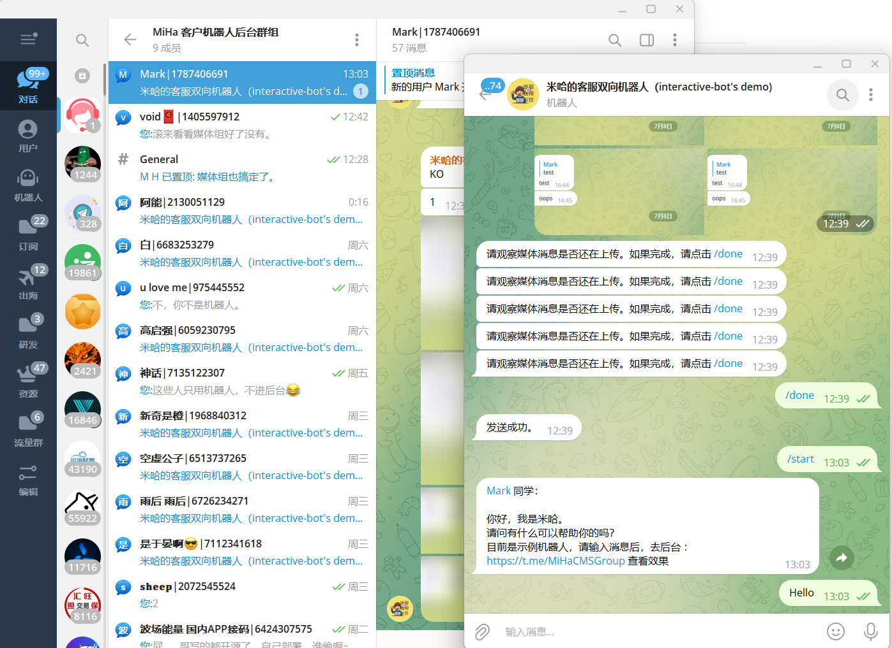

# Telegram interactive bot (Telegram Bidirectional Bot)

## I. Introduction

An open-source bidirectional bot for Telegram. It helps to avoid spam messages and allows restricted clients to contact you smoothly.

[中文文档](https://github.com/MiHaKun/Telegram-interactive-bot/blob/master/README.md) | [Sample Bot](https://t.me/CustomerConnectBot) | [Sample Backend](https://t.me/MiHaCMSGroup)

(Note: After interacting with the sample bot, check the background to understand the principle.)

(Note: The sample background is a public group for demonstration purposes. For private deployment, it's recommended to use a private group for security reasons.)



### Features
- When a client contacts customer service through the bot, all messages will be completely forwarded to the background management group, creating a separate sub-forum named after the client's information to distinguish them from other clients.
- Replies from customer service in the sub-forum can be directly sent to the client.
- Customer service can configure whether to continue the conversation with the client by closing/opening the sub-forum.
- Provides a permanent ban solution. There is a switch in the environment variables.
- Provides a /clear command to clear all messages in the sub-forum, also deleting user messages (not recommended, but sometimes necessary). There is a switch in the environment variables.

### Advantages
- By using sub-forums, multiple management members can be added to share the customer service workload.
- Complete communication records with clients can be intuitively retained.
- It's possible to know which customer service representative replied to a particular message, maintaining coherent customer service.

## 2. Preparation
The main principle of this bot is to forward the conversation between the client and the bot to a group (preferably a private group) and categorize each client's messages into a sub-category. Therefore, before starting, you need to:
1. Find @BotFather and apply for a bot.
2. Obtain the bot's token.
3. Get API_ID/API_HASH.
4. Create a group (set as public as needed).
5. Enable "Topics" in the group.
6. Add your bot to the group and promote it to an administrator.
7. Remember to include "Message Management" and "Topic Management" in the administrative permissions.
8. Use the bot @GetTheirIDBot to get the built-in ID and administrator user ID of the group.

   

## 3. Deployment and Execution

### 1. Modify .env
Open `.env_example`, fill in your bot's Token, account's API_ID/HASH, the management group's ID, and the administrator's ID. Save `.env_example` as `.env`.

### 2. Build Python venv
```
python3 -m venv venv
. venv/bin/activate
pip install -r requirements.txt
```

### 3. Start Execution
```
python -m interactive-bot
```

**Note:** For formal operation, it's recommended to use process management tools like `PM2`, `supervisor`, etc., along with watchdogs to achieve uninterrupted operation, automatic restart, and failure recovery.

# ToDoList
- [x] Support message reply functionality. Messages can reference each other.
- [x] Improve the database.
- [ ] Add client's human-machine recognition to prevent bored individuals from using userbots to spam.
- [x] Add and recognize media group messages.
- [x] Streamline the code, use payload to expand forwarding parameters.

# About

- This product is open-source under the Apache License.
- The author, MiHa (@MrMiHa), is a struggling programmer, not a coal miner. If you have questions, please don't come and give orders.
- Discussion group: https://t.me/DeveloperTeamGroup. Feel free to join and play around.
- Feel free to fork, but remember to retain the content in "About".
- The initial version was written in 2 hours. If you like it, please donate. If you have trouble deploying, ask for help in the group.
- RackNerd's servers are recommended. In fact, I use this one. It's cheap enough.
This one is enough: [2 cores 3GB - $27 per year](https://my.racknerd.com/aff.php?aff=11705&pid=828)
- If you can't deploy it, you can ask everyone in the group to help. You can also share servers with everyone: https://t.me/DeveloperTeamGroup.
